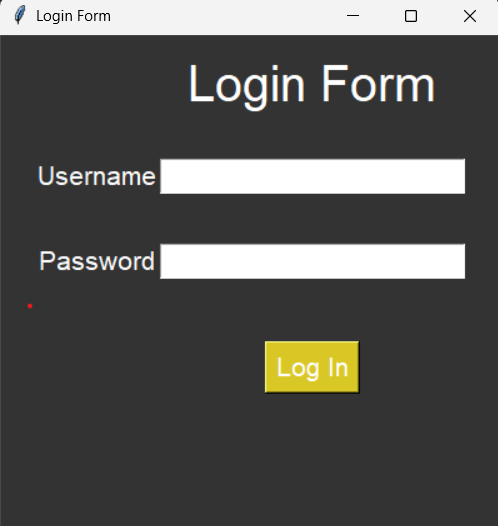

# Tkinter Login Form

This is a simple login form built using Python's `tkinter` module. It provides a basic GUI where users can enter a username and password to log in.

## 🖥 Features

- Graphical User Interface using `tkinter`
- Basic username and password check
- Shows success or error message using `messagebox`

## 🧰 Requirements

- Python 3.x

No additional packages are needed beyond the standard Python installation.

## 🚀 How to Run

1. Make sure Python is installed on your system.
2. Save the code in a file named `login_form.py`.
3. Open a terminal or command prompt.
4. Run the script:

